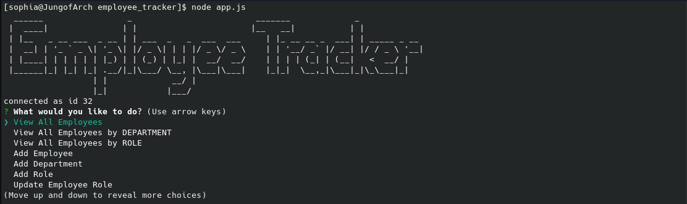
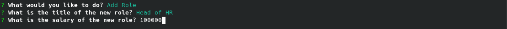

# Employee Tracker
 

## Description
This command line application allows a user to manage an employee database. The user is able to view employees based on certain criteria, add new departments, add new roles, and update employee information. The user can view employee information as well, which includes their full name, ID number, role, salary, department, and manager (if applicable). The application is built using Node.js, inquirer, and mySQL. To minimize user error, most of the inquirer prompts are list type prompts with choices that are populated by existing/valid content. When initializing the application, an ASCII text art title is shown. This was created using figlet.

## Table Of Contents
- [Access and Installation](#Access-and-Installation)
- [Usage](#Usage)
- [Features](#Features)
- [License](#License)
- [Contribution Guidelines](#Contribution-Guidelines)
- [Test Instructions](#Test-Instructions)
- [Questions](#Questions)

## Access and Installation

No external software or servers are necessary to install this project except for a text editor and a working browser. You can git clone this repository to your local computer and open the code files using a text editor. Once the correct npm packages are installed, the program can be run from the command line as long as you are in the same directory as the code files. The repository includes the package.json file needed to install the correct npm pacakges/dependencies. 

This project can be accessed either via the GitHub Repository.

- [GitHub Repository](https://github.com/sophia2798/employee_tracker)
- [Deployed Page](https://sj-note-taker.herokuapp.com/)

To open and edit code files, you will need a text editor. The one used to create this page was Visual Studio Code (https://code.visualstudio.com/).

To install this repository, you can git clone the repository using the green "Code" button. You can copy and paste either the HTML or SSH URL.

## Usage
This project can be used to manage and update employee database systems. By displaying data outputs in tables in the command line, users can easily view the employees in the database along with their pertinent information (i.e. salary, role, department, etc.).

This project can also be used as a template to learn more about server side coding, routing, mySQL, and creating/updating/using databases.

## Features
This project includes...

- An ASCII text title and main menu. From the main menu, a user can view all employees, view all employees by department or role, add a new department, role, or employee, update an employee's role, and quit the application.

- The ability to view all employees with all their associated information.

- The ability to view employees by a specific department. The department can be chosen from a list, to minimize user error. The output is then shown as a command line table. The same functionality with a list prompt and table output is available if the user wants to view employees by role.

- The ability to add a new role. Adding a new role consists of an input prompt for the role title, a number prompt for its salary, and list prompt to choose which department it is a part of (not shown).

- The ability to add a new department. Adding a new department consists of one input prompt for the department's name.

- The ability to add an employee. This consists of multiple input and list prompts for the employee's full name, role, salary, department, and, if applicable, their manager.

- The ability to update an employee's role. This consists of two list type prompts to choose the employee to update and then to choose their new role.

## License
MIT
A short and simple permissive license with conditions only requiring preservation of copyright and license notices. Licensed works, modifications, and larger works may be distributed under different terms and without source code.

## Contribution Guidelines
Currently, this repository is not set up for contributions. A development branch, to which all merges can be made while protecting the master branch, must be made first. Therefore, please contact the owner(s) of this repository to start and manage such a branch.

Please ensure that PRIOR to any new contributions, you discuss your desired/planned changes via email with the owner(s) of the repository. Contact information can be found in the [Questions](#Questions) section. Changes should be reflected in an updated README as well. To ensure a high quality of code and minimal conflicts, pull requests can only be merged after being approved by another developer. 

To ensure a welcoming working environment, any contributor to this project must help maintain a harassment-free and safe environment. This includes:
    - Using inclusive language
    - Being respectful of various backgrounds and opinions
    - Accepting constructive criticism without aggression or anger
    - Being aware of what benefits the whole community
    - Showing kindness and empathy to one another

## Test Instructions
As the package.json file exists in this repository, only the following line is needed to install the necessary pacakges

    npm install

To run the program, input the following code into the command line

    npm start

## Questions
If you have any questions, please feel free to reach out via email at sdf. Any further information can be found on my [GitHub Profile](https://github.com/sophia2798) or my [LinkedIn Profile](https://linkedin.com/in/sophia2798).